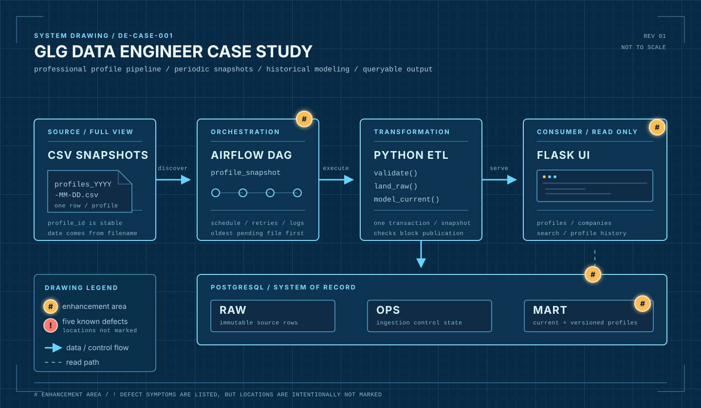

# GLG Data Engineer Case Study

This repository contains a small data application used for a Data Operations Engineer take-home exercise.

This repository is provided under the [GLG Data Engineer Case Study Evaluation License](LICENSE) for local candidate-evaluation use only.

## What The Application Does

A fictional vendor periodically provides a complete **Snapshot** of its professional-profile data as a dated CSV. The pipeline validates and retains the source rows, models the current profile state in PostgreSQL, and publishes the results through a Flask web application.

Later Snapshots can show that a profile has changed company, job title, or department. The intended extended model preserves those changes as **Slowly Changing Dimension Type 2** history: the incoming CSV files are Snapshots, while the derived profile history is the SCD Type 2 model. An explicit `is_active=false` closes a current profile; absence from one Snapshot does not imply inactivity.

[](assets/pipeline-blueprint.svg)

`#` marks an enhancement area. The four known defect locations are intentionally not marked; their observed symptoms are listed in `CANDIDATE_INSTRUCTIONS.md`.

## 0. Prerequisites

- Git
- Docker Desktop with Docker Compose
- macOS on Apple Silicon or Intel, or Windows using WSL2

No host Python or PostgreSQL installation is required.

Install Docker Desktop if needed:

- Windows: https://docs.docker.com/desktop/setup/install/windows-install/
- macOS: https://docs.docker.com/desktop/setup/install/mac-install/

On Windows, Docker Desktop may require WSL2 and hardware virtualization. Follow Docker's installation guide if either is not enabled. Accept any Docker Desktop prompt requesting file-sharing access for this repository.

Confirm Docker is running:

```console
docker --version
docker compose version
```

## 1. Clone The Repository

Clone the private repository URL provided by the hiring team, then open its directory:

```console
git clone <repository-url>
cd <repository-directory>
```

You do not need to fork the repository.

## 2. Start The Application

From the repository root:

```console
docker compose up --build --detach
```

Initial image downloads and Airflow setup may take several minutes. To optionally follow startup logs:

```console
docker compose logs --follow
```

Press `Ctrl+C` to stop following the logs. The containers continue running in the background.

In the same terminal, check service status:

```console
docker compose ps
```

Wait until `postgres`, `web`, and `airflow-webserver` report healthy and `airflow-scheduler` reports running. The one-time `app-migrate` and `airflow-init` services should exit successfully.

When startup completes:

- Flask: http://localhost:5050
- Airflow: http://localhost:8080
- Airflow username and password: `airflow` / `airflow`

## 3. Run The Pipeline

The Baseline DAG processes `profiles_2026-01-15.csv`.

1. Open Airflow at http://localhost:8080.
2. Sign in with `airflow` / `airflow`.
3. Open the `profile_snapshot` DAG.
4. Unpause the DAG if needed.
5. Trigger a run using the play button.
6. Open the task instance to inspect its logs and result.

The DAG is manual-only for this exercise; it will not create a scheduled run when you unpause it.

## 4. Inspect The Results

The Flask application provides:

- `/`: pipeline overview and Snapshot loads
- `/profiles`: searchable current active profiles
- `/profiles/<profile_id>`: profile history page to complete during the case study
- `/companies`: active profile counts by company

Refresh Flask after the DAG completes.

## 5. Run Checks

With PostgreSQL running:

```console
docker compose run --rm tests
```

## 6. Generate Query-Plan Data

The checked-in Snapshots stay small enough to inspect manually. Generate a larger deterministic current-profile dataset when examining profile-search query plans:

```console
docker compose run --rm generate-performance-data
```

Generated profile IDs start with `PERF-`. Running the command again replaces prior generated rows.

## 7. Complete The Case Study

Follow the Requested Changes in [`CANDIDATE_INSTRUCTIONS.md`](CANDIDATE_INSTRUCTIONS.md) to complete the case study. That document also explains validation, scope, the follow-up walkthrough, and support expectations.

## Troubleshooting

- Confirm Docker Desktop is running before invoking Docker Compose.
- Use `docker compose ps` to inspect service status.
- If an address is unavailable, compare the running services with the documented application addresses.
- On Windows, keep the repository inside the WSL2 filesystem if bind-mounted files are slow or permission behavior is inconsistent.
- Airflow task logs are available in the UI and in the local `airflow-logs/` directory.
- A task attempt is typically stored under `airflow-logs/dag_id=profile_snapshot/run_id=.../task_id=load_available_snapshots/attempt=1.log`.
- Use `docker compose logs web` to inspect Flask startup failures.
- Use `docker compose logs airflow-scheduler` to inspect DAG scheduling failures.

### Reset Local State

Only reset if you need a clean database and Airflow environment while troubleshooting. This permanently removes local pipeline results, task history, and database state, but does not delete your code changes or the local `airflow-logs/` folder.

```console
docker compose down --volumes
docker compose up --build --detach
```
